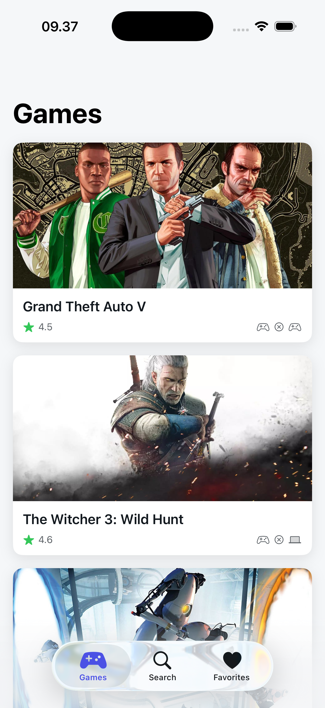
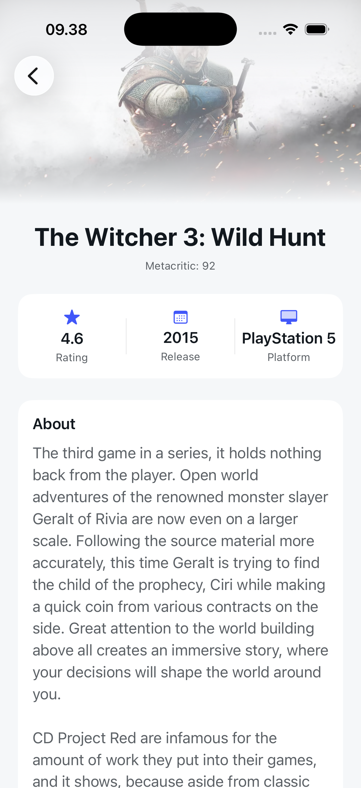
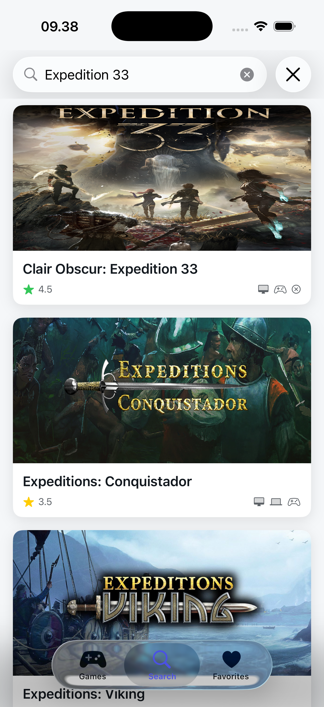
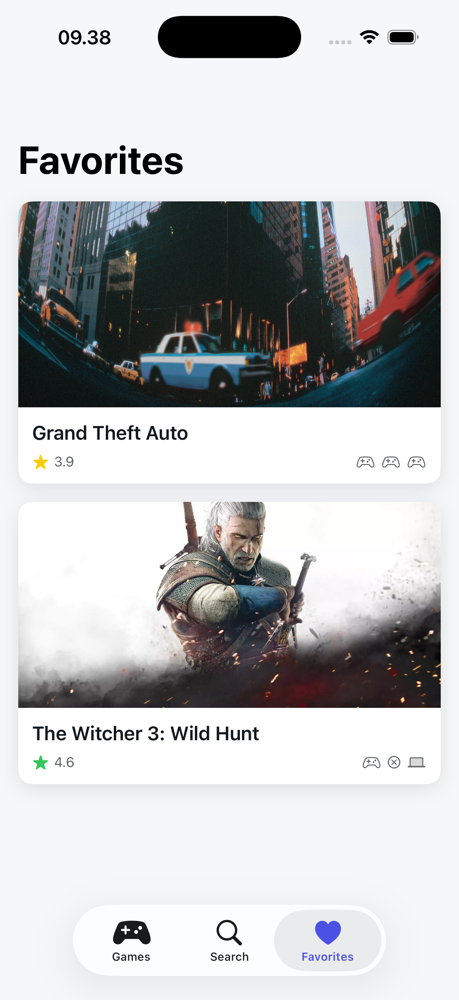
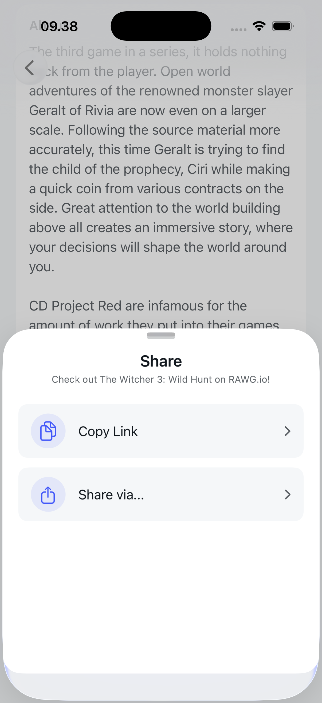
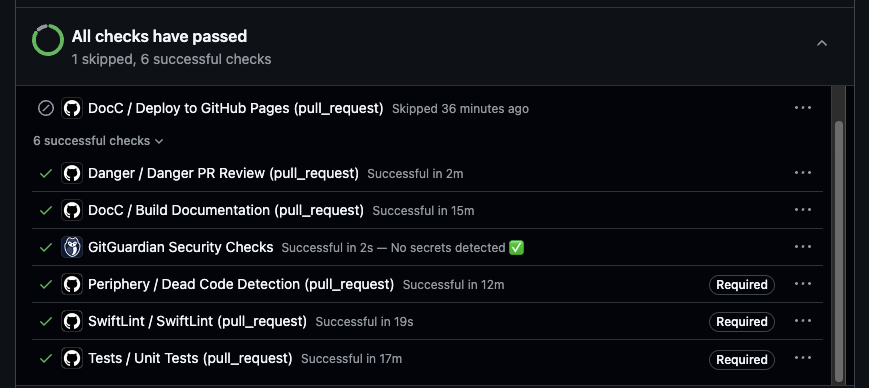
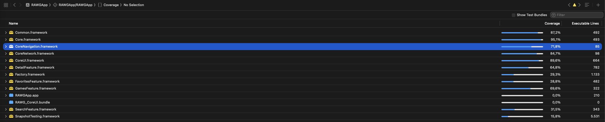
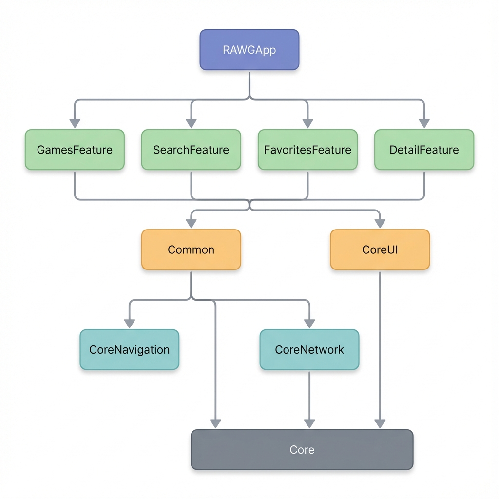

<p align="center">
  
</p>

<h1 align="center">🎮 RAWG.IO</h1>

<p align="center">
  <strong>A production-ready iOS application showcasing modern Swift development practices</strong>
</p>

<p align="center">
  
  
  
  
  
</p>

<p align="center">
  <a href="#-features">Features</a> •
  <a href="#-screenshots--demos">Screenshots</a> •
  <a href="#-architecture">Architecture</a> •
  <a href="#-tech-stack">Tech Stack</a> •
  <a href="#-automation--cicd">CI/CD</a> •
  <a href="#-testing-strategy">Testing</a> •
  <a href="#-getting-started">Getting Started</a>
</p>

---

## 📱 Features

- **Browse Games** — Explore the extensive RAWG.io database with infinite scrolling
- **Search** — Real-time search with debouncing and caching
- **Game Details** — Rich game information with screenshots and descriptions
- **Favorites** — Persist favorite games locally with SwiftData
- **Share** — Share games via custom bottom sheet

---

## 🎬 Screenshots & Demos


### App Showcase

| Games List | Game Details | Search |
|:----------:|:------------:|:------:|
|  |  |  |

### Favorites & Share

| Favorites | Share Sheet |
|:---------:|:-----------:|
|  |  |

### CI/CD Pipeline (All Green ✅)

> **Placeholder** - Add a GIF or screenshot showing your GitHub Actions with all checks passing.



### Test Coverage Report


---

## 🏛️ Architecture

This project implements **Clean Architecture** with strict **module encapsulation**, ensuring separation of concerns and testability at every layer.

### Module Dependency Graph

<p align="center">
  
</p>

> **Layers:** App → Feature Modules → Shared (Common, CoreUI) → Core (Core, CoreNavigation, CoreNetwork)

### Clean Architecture Layers

Each **Feature Module** follows Clean Architecture with clear layer separation:

```
Modules/GamesFeature/
├── Sources/
│   ├── DI/                  # Dependency Injection (Factory)
│   ├── Data/                # Repositories, Data Sources
│   ├── Domain/              # UseCases, Entities
│   ├── Navigation/          # Navigator (Public API)
│   └── Presentation/        # Views, ViewModels
└── Tests/                   # Unit & Snapshot Tests
```

| Layer | Responsibility | Example |
|-------|----------------|---------|
| **Presentation** | UI components, ViewModels | `GamesListView`, `GamesViewModel` |
| **Domain** | Business logic, UseCases | `GetGamesUseCase`, `SearchGamesUseCase` |
| **Data** | Data access, Repository impl | `GamesRepository`, `DefaultFavoritesService` |
| **Navigation** | **Public API** - Only exposed interface | `GamesNavigator` |
| **DI** | Dependency registration | `GamesFeatureAssembly` |

### Module Encapsulation

Following **strict encapsulation principles**, each feature module exposes **only its Navigator** as the public interface:

```swift
// ✅ Public - The only entry point to the module
public final class GamesNavigator {
    public func makeGamesListView() -> some View
    public func getGameDetailUseCase() -> GetGameDetailUseCaseProtocol
}

// ❌ Internal - Not accessible outside the module
internal final class GamesViewModel: ObservableObject { }
internal struct GamesListView: View { }
internal final class GetGamesUseCase { }
```

---

## 🛠️ Tech Stack

### Core Modules

| Module | Purpose | Key Components |
|--------|---------|----------------|
| **Core** | Foundation utilities | `Logger`, `ImageCache`, `SwiftData`, Extensions |
| **CoreNavigation** | Type-safe navigation | `NavigationRouter`, `RouteProtocol`, `SheetProtocol` |
| **CoreNetwork** | Networking layer | `APIClient` (Actor-based), `APIRequest`, `APIError` |
| **CoreUI** | Reusable UI components | Theme, Design System, Custom Views |
| **Common** | Shared business logic | Entities, Repositories, Protocols |

### Key Technologies

| Category | Technology |
|----------|------------|
| **UI Framework** | SwiftUI |
| **Concurrency** | Swift Concurrency (async/await, Actors) |
| **Persistence** | SwiftData |
| **Dependency Injection** | [Factory](https://github.com/hmlongco/Factory) |
| **Image Caching** | Custom Actor-based cache (Memory + Disk) |
| **Navigation** | Custom type-safe router with sheet support |
| **Project Management** | [Tuist](https://tuist.io) |
| **Testing** | XCTest, [SnapshotTesting](https://github.com/pointfreeco/swift-snapshot-testing) |

---

## 🎯 Design Principles

### SOLID Principles

| Principle | Implementation |
|-----------|----------------|
| **S**ingle Responsibility | Each class has one reason to change (e.g., `APIClient` only handles network requests) |
| **O**pen/Closed | Protocols enable extension without modification (e.g., `APIRequest`, `RouteProtocol`) |
| **L**iskov Substitution | Protocol conformances are substitutable (e.g., `URLSessionProtocol` for testing) |
| **I**nterface Segregation | Small, focused protocols (e.g., `AddFavoriteUseCaseProtocol` vs monolithic service) |
| **D**ependency Inversion | High-level modules depend on abstractions, not concretions (UseCase protocols) |

### Clean Code Practices

- **Dependency Injection** — All dependencies injected via Factory
- **Protocol-Oriented Design** — Abstractions over implementations
- **Actor Isolation** — Thread-safe concurrency with Swift Actors
- **Immutability** — Prefer `let` over `var`, value types over reference types
- **Single Source of Truth** — ViewModels own UI state

---

## ⚡ Automation & CI/CD

This project implements a comprehensive **5-workflow CI/CD pipeline** using GitHub Actions, ensuring code quality, test coverage, and automated documentation deployment.

### Pipeline Overview

| Workflow | Trigger | Purpose | Status |
|----------|---------|---------|--------|
| **Tests** | Push/PR to `main` | Unit tests, Snapshot tests, Code coverage | [](#) |
| **SwiftLint** | Push/PR (`.swift` files) | Enforces 60+ lint rules | [](#) |
| **Danger** | Pull Requests | Automated PR review & feedback | [](#) |
| **Periphery** | Push/PR (`.swift` files) | Dead code detection | [](#) |
| **DocC** | Push to `main` | Documentation generation & deployment | [](#) |

---

### 1️⃣ Tests Workflow

> **File:** `.github/workflows/tests.yml`

Runs comprehensive unit and snapshot tests on every push and pull request to `main`.

**Trigger:**
- Push to `main` branch
- Pull requests targeting `main`

**Key Features:**
- 🧪 **Unit Tests** — Validates ViewModels, UseCases, Repositories
- 📸 **Snapshot Tests** — Visual regression testing for SwiftUI views
- 📊 **Code Coverage** — Generates coverage reports via `xcresult`
- 🔄 **Concurrency Control** — Cancels in-progress runs on new commits
- 📦 **Artifact Upload** — Stores test results for 14 days

**Pipeline Steps:**
```
1. Checkout code
2. Setup Xcode 16.1
3. Prepare iOS Simulator
4. Install Tuist via Mise
5. Fetch dependencies (tuist install)
6. Generate project (tuist generate)
7. Run tests with code coverage
8. Upload test results & coverage
9. Cleanup simulator
```

---

### 2️⃣ SwiftLint Workflow

> **File:** `.github/workflows/swiftlint.yml`

Enforces Swift code style consistency across the entire codebase.

**Trigger:**
- Push/PR to `main` with changes to `*.swift` or `.swiftlint.yml`

**Key Features:**
- ✅ **60+ Lint Rules** — Comprehensive code style enforcement
- 📝 **GitHub Actions Logging** — Inline annotations on violations
- ⚡ **Fast Execution** — Only runs when Swift files change

**Custom Rules Enforced:**
```yaml
# No print statements in production code
no_print_statement:
  regex: "\\bprint\\s*\\("
  message: "Use Logger instead of print()"
    
# No DispatchQueue usage
no_direct_dispatch:
  regex: "DispatchQueue\\.(main|global)"
  message: "Use async/await instead of DispatchQueue"
```

**Rule Categories:**
| Category | Examples |
|----------|----------|
| **Code Safety** | `force_unwrapping`, `implicitly_unwrapped_optional`, `fatal_error_message` |
| **Code Style** | `closure_spacing`, `operator_usage_whitespace`, `modifier_order` |
| **Performance** | `first_where`, `last_where`, `contains_over_filter_count` |
| **Complexity** | `cyclomatic_complexity` (max 15), `function_body_length` (max 100) |

---

### 3️⃣ Danger Workflow

> **File:** `.github/workflows/danger.yml`  
> **Config:** `danger/Dangerfile.swift`

Provides intelligent, automated PR review with actionable feedback.

**Trigger:**
- Pull requests (opened, synchronized, reopened, edited)

**Key Features:**
- 📏 **PR Size Checks** — Warns for large PRs (>500 lines, >20 files)
- 🧪 **Test Coverage Enforcement** — Ensures tests accompany source changes
- 📝 **PR Template Validation** — Verifies description and type selection
- 🔗 **Issue Linking** — Suggests linking related issues
- ⚠️ **Critical File Alerts** — Warns on `Project.swift`, `Tuist.swift` changes
- 📦 **Module Structure Checks** — Monitors Clean Architecture compliance
- 🔍 **SwiftLint Integration** — Inline lint comments on changed lines

**PR Validation Rules:**
```swift
// Configuration
enum Config {
    static let maxPRLines = 500        // Max lines changed
    static let maxFilesChanged = 20    // Max files modified
    static let requiredReviewers = 1   // Minimum reviewers
}

// PR Size Warning
if totalChanges > Config.maxPRLines {
    warn("⚠️ Consider breaking into smaller PRs")
}

// Test Coverage Check
if !changedSourceFiles.isEmpty && changedTestFiles.isEmpty {
    warn("🧪 Source files modified but no tests added")
}

// New File Test Requirement
for sourceFile in createdFiles where isSourceFile(sourceFile) {
    if !hasCorrespondingTest {
        warn("📁 New file doesn't have a corresponding test file")
    }
}
```

---

### 4️⃣ Periphery Workflow

> **File:** `.github/workflows/periphery.yml`

Detects unused code (dead code) to maintain a clean codebase.

**Trigger:**
- Push/PR to `main` with changes to `*.swift`, `.periphery.yml`, or `Project.swift`
- Manual trigger via `workflow_dispatch`

**Key Features:**
- 🔍 **Dead Code Detection** — Finds unused classes, functions, properties
- 🎯 **Multi-Target Scanning** — Analyzes all feature modules
- 📊 **GitHub Actions Reporter** — Inline annotations for unused code
- ⚡ **Skip Build Mode** — Uses pre-built index for faster execution
- 🔒 **Retains Public APIs** — Ignores intentionally exposed interfaces

**Scanned Targets:**
```bash
--targets RAWGApp \
--targets Core \
--targets CoreUI \
--targets CoreNetwork \
--targets GamesFeature \
--targets SearchFeature \
--targets FavoritesFeature
```

**Configuration Flags:**
| Flag | Purpose |
|------|---------|
| `--retain-public` | Keep public APIs even if unused internally |
| `--retain-objc-accessible` | Keep `@objc` exposed code |
| `--relative-results` | Show relative file paths |
| `--format github-actions` | Output inline PR annotations |

---

### 5️⃣ DocC Workflow

> **File:** `.github/workflows/docc.yml`

Generates and deploys Swift documentation to GitHub Pages.

**Trigger:**
- Push to `main` with changes to `*.swift`, `*.md`, or `*.docc/**`
- Pull requests (build only, no deploy)
- Manual trigger via `workflow_dispatch`

**Key Features:**
- 📚 **Multi-Module Documentation** — Generates docs for all modules
- 🌐 **GitHub Pages Deployment** — Automatic hosting at project URL
- 🎨 **Styled Index Page** — Custom dark-mode landing page
- 🔄 **Incremental Builds** — Only rebuilds on documentation changes

**Documented Modules:**
```bash
SCHEMES=("RAWGApp" "Core" "CoreNavigation" "CoreNetwork" "CoreUI" "Common")
```

**Pipeline Steps:**
```
1. Checkout code
2. Setup Xcode 16.2
3. Install iOS Simulator
4. Generate project with Tuist
5. Build project for documentation symbols
6. Generate DocC archives for each module
7. Transform archives for static hosting
8. Create styled index page
9. Deploy to GitHub Pages (main branch only)
```

**Live Documentation:** [📖 View Documentation](https://finnchristoffer.github.io/RAWG.IO)

---

### CI/CD Best Practices

This pipeline implements several best practices:

| Practice | Implementation |
|----------|----------------|
| **Concurrency Control** | Cancels in-progress runs on new commits |
| **Caching** | SPM package cache for faster builds |
| **Conditional Triggers** | Path-based filtering (only run when relevant files change) |
| **Artifact Retention** | Test results stored for 14 days |
| **Parallel Execution** | Independent workflows run concurrently |
| **Fail-Fast** | Early failure detection with clear feedback |

---

## 🧪 Testing Strategy

### Test-Driven Development (TDD)

All features are developed following the **Red-Green-Refactor** cycle:

```
1. 🔴 Write failing test
2. 🟢 Write minimal code to pass
3. 🔵 Refactor while tests stay green
```

### Test Types

| Type | Framework | Coverage |
|------|-----------|----------|
| **Unit Tests** | XCTest | ViewModels, UseCases, Repositories |
| **Snapshot Tests** | swift-snapshot-testing | SwiftUI Views |
| **Integration Tests** | XCTest | API Client, SwiftData |

### Snapshot Testing

```swift
func test_gameDetailView_displaysGameInfo() {
    // Arrange
    let viewModel = GameDetailViewModel(
        gameId: 123,
        gameName: "The Witcher 3: Wild Hunt",
        rating: 4.5,
        isPreview: true
    )
    let view = GameDetailView(viewModel: viewModel)
        .frame(width: 390, height: 844)

    // Assert
    assertSnapshot(of: view, as: .image)
}
```

### Test Helpers

```swift
// Memory Leak Detection
func makeSUT() -> (sut: ViewModel, spy: RepositorySpy) {
    let spy = RepositorySpy()
    let sut = ViewModel(repository: spy)
    trackForMemoryLeaks(sut)
    return (sut, spy)
}
```

---

## 🚀 Getting Started

### Prerequisites

- **Xcode 16.0+**
- **iOS 17.0+**
- **[Mise](https://mise.jdx.dev/)** (for Tuist installation)

### Installation

```bash
# 1. Clone the repository
git clone https://github.com/finnchristoffer/RAWG.IO.git
cd RAWG.IO

# 2. Install Tuist via Mise
mise install

# 3. Fetch dependencies
tuist install

# 4. Generate Xcode project
tuist generate

# 5. Open workspace
open RAWG.xcworkspace
```

### API Key Setup

1. Get your free API key from [RAWG.io](https://rawg.io/apidocs)
2. Add to your environment or configuration:

```swift
// In your local configuration
let apiKey = "YOUR_API_KEY"
```

---

## 📚 Documentation

Documentation is automatically generated and deployed via **DocC**:

🔗 **[View Live Documentation](https://finnchristoffer.github.io/RAWG.IO)**

### Generate Locally

```bash
# Build documentation
xcodebuild docbuild \
  -workspace RAWG.xcworkspace \
  -scheme Core \
  -destination 'platform=iOS Simulator,name=iPhone 16'
```

---

## 📁 Project Structure

```
RAWG.IO/
├── 📱 RAWGApp/                    # Main app target
│   ├── Sources/
│   │   ├── RootView.swift
│   │   └── RAWGApp.swift
│   └── Resources/
│
├── 📦 Modules/
│   ├── Core/                      # Foundation utilities
│   ├── CoreNavigation/            # Type-safe navigation
│   ├── CoreNetwork/               # Networking layer
│   ├── CoreUI/                    # Design system
│   ├── Common/                    # Shared business logic
│   ├── GamesFeature/              # Games list feature
│   ├── SearchFeature/             # Search feature
│   ├── FavoritesFeature/          # Favorites feature
│   └── DetailFeature/             # Game detail feature
│
├── ⚙️ Configuration/
│   ├── Project.swift              # Tuist project definition
│   ├── Tuist.swift                # Tuist configuration
│   ├── .swiftlint.yml             # SwiftLint rules
│   └── .periphery.yml             # Periphery configuration
│
├── 🤖 .github/workflows/
│   ├── tests.yml                  # Unit & Snapshot tests
│   ├── swiftlint.yml              # Code style checks
│   ├── danger.yml                 # PR automation
│   ├── periphery.yml              # Dead code detection
│   └── docc.yml                   # Documentation
│
└── 🛡️ danger/
    └── Dangerfile.swift           # PR review rules
```

---

## 🗺️ Roadmap

### 🎯 Priority (Next Update)

| # | Feature | Description | Status |
|:-:|---------|-------------|:------:|
| 1 | **UI Renewal** | Redesign with modern animations, polished transitions, and improved visual hierarchy | 🔜 Planned |
| 2 | **80% Test Coverage** | Increase unit test coverage across all modules to ensure reliability | 🔜 Planned |
| 3 | **Custom DI Framework** | Replace Factory with custom dependency injection implementation | 🔜 Planned |

### ✨ Future Enhancements

| Feature | Description |
|---------|-------------|
| **Offline Mode** | Cache games data for browsing without internet connection |
| **Theme System** | Dark/Light theme with system-aware automatic switching |
| **Localization** | Multi-language support (EN, ID, etc.) |
| **iOS Widgets** | Home screen widgets showing favorite games |
| **Deep Links** | Share direct links to specific game details |
| **Performance Monitoring** | Crash reporting & analytics integration |
| **Accessibility** | VoiceOver support, Dynamic Type, contrast improvements |
| **Enhanced Loading** | Skeleton loading states, improved pull-to-refresh |

> 💡 Have a suggestion? Feel free to [open an issue](https://github.com/finnchristoffer/RAWG.IO/issues)!

---

## 🤝 Contributing

Contributions are welcome! Please follow these guidelines:

1. **Fork** the repository
2. Create a **feature branch** (`git checkout -b feature/amazing-feature`)
3. **Write tests first** (TDD approach)
4. Ensure **all CI checks pass**
5. Submit a **Pull Request**

### PR Checklist

- [ ] Tests added/updated
- [ ] Documentation updated
- [ ] SwiftLint passes
- [ ] Snapshot tests updated (if UI changes)
- [ ] PR description follows template

---

## 📄 License

This project is licensed under the MIT License - see the [LICENSE](LICENSE) file for details.

---

<p align="center">
  Built with ❤️ using Swift, SwiftUI, and Clean Architecture
</p>

<p align="center">
  <a href="https://github.com/finnchristoffer">
    
  </a>
</p>
